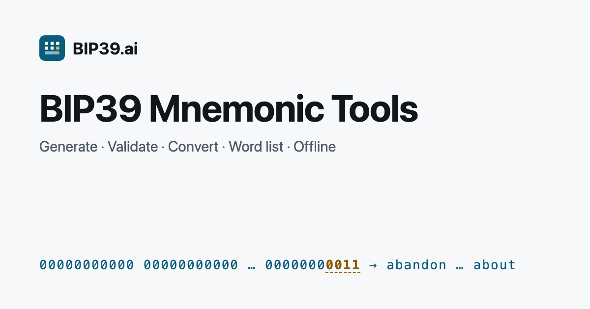

# BIP39.ai

**Offline-first, open-source BIP39 tools that run entirely in your browser.**

**→ Use it at [bip39.ai](https://bip39.ai/)** · [Download the offline file](https://bip39.ai/bip39-offline/) · [Security model](https://bip39.ai/security/)



## Tools

| Tool | What it does |
|---|---|
| [Generator](https://bip39.ai/bip39-generator/) | 12, 15, 18, 21 or 24-word test mnemonics from `crypto.getRandomValues`, with entropy and checksum shown |
| [Validator](https://bip39.ai/bip39-validator/) | Checks word count, wordlist membership (with suggestions for typos) and checksum |
| [Converter](https://bip39.ai/bip39-converter/) | Entropy → mnemonic, mnemonic → entropy, mnemonic + passphrase → 512-bit seed |
| [Checksum](https://bip39.ai/bip39-checksum/) | Step-by-step walkthrough: entropy bits, SHA-256, checksum bits, 11-bit groups, words |
| [Word List](https://bip39.ai/bip39-word-list/) | The official 2048 English words; search, and download as TXT / JSON / CSV |
| [Passphrase demo](https://bip39.ai/bip39-passphrase/) | How one mnemonic gives different seeds with different passphrases |

Plus explainers: [What is BIP39?](https://bip39.ai/what-is-bip39/) and [guides](https://bip39.ai/guides/).

**Not included, on purpose:** private keys, addresses, balance checks, wallet recovery, brute-forcing missing words, accounts, analytics.

## Security model

- **No input leaves the page.** All BIP39 work happens in the browser. The site sends a Content Security Policy with `connect-src 'none'`, so page scripts cannot make network requests — you can check this in your browser's Network panel.
- **No third-party code.** No ads, analytics, trackers, CDNs or web fonts. Scripts and styles come only from the same origin.
- **Nothing stored.** Inputs never go into cookies, local/session storage, IndexedDB or the URL, and sensitive fields are not inside forms.
- **Honest limits.** A website can still be changed by whoever controls its server, and a compromised device can read the screen. **Don't type a real recovery phrase into any website.** For real phrases, use the offline file on a disconnected device.

Not yet available: independent security audit, reproducible builds, signed releases. Details: [bip39.ai/security](https://bip39.ai/security/).

## Offline file

A single HTML file with the generator, validator, converter, checksum and word list inlined. Its own CSP allows only its hashed inline script and style, and forbids all connections.

1. Download it from [bip39.ai/bip39-offline](https://bip39.ai/bip39-offline/), which publishes its SHA-256.
2. Verify:
   ```bash
   shasum -a 256 bip39-ai-offline-v0.1.0.html          # macOS / Linux
   Get-FileHash .\bip39-ai-offline-v0.1.0.html -Algorithm SHA256   # Windows PowerShell
   ```
3. Disconnect from the network, then open the file in a browser.

You can also build it yourself from this repository (`npm run build` → `dist/downloads/`).

## Correctness

Every build runs the test suite before building:

- all 24 official English [BIP39 test vectors](https://github.com/trezor/python-mnemonic/blob/master/vectors.json) (entropy ↔ mnemonic, seed with passphrase `TREZOR`, checksum steps);
- 120 random cases cross-checked against the independent [python-mnemonic](https://github.com/trezor/python-mnemonic) reference implementation, across all word counts and non-ASCII passphrases;
- 40 invalid-checksum phrases that must be rejected;
- the English wordlist byte-for-byte against [bitcoin/bips `english.txt`](https://github.com/bitcoin/bips/blob/master/bip-0039/english.txt) (SHA-256 `2f5eed53…3b24dbda`).

Mnemonic encoding and seed derivation use [@scure/bip39](https://github.com/paulmillr/scure-bip39) and [@noble/hashes](https://github.com/paulmillr/noble-hashes) (pinned versions).

## Development

Requires Node ≥ 22 (see `.nvmrc`).

```bash
npm install
npm run dev          # local dev server
npm test             # test vectors and cross-checks
npm run build        # static site + offline file in dist/
npm run check:dist   # CSP compatibility, SEO basics, internal links
```

Stack: [Astro](https://astro.build/) static site, TypeScript, plain CSS. Hosted on Cloudflare Workers static assets. See [DEPLOY.md](DEPLOY.md).

Project layout: `src/lib/bip39.ts` (core logic) · `src/components/Tool*.astro` (tools) · `src/pages/` (pages and guides) · `scripts/` (build and checks) · `data/upstream/` (pinned official wordlist and vectors) · `design/` (design docs).

## Contributing and security reports

Issues and pull requests are welcome. Please report vulnerabilities privately via [GitHub security advisories](https://github.com/gonglian8-stack/bip39-ai/security/advisories/new), not public issues — see [SECURITY.md](SECURITY.md).

## License

[MIT](LICENSE) · Maintained by [gonglian8-stack](https://github.com/gonglian8-stack)

<details>
<summary>中文说明</summary>

BIP39.ai 是开源、离线优先的 BIP39 工具站，所有计算都在浏览器本地完成，页面无法发起网络请求。产品规划、关键词和页面规格见 [PLANNING.zh-CN.md](PLANNING.zh-CN.md) 与相关中文文档，设计文档见 `design/`，内容更新流程见 [CONTENT-GUIDE.md](CONTENT-GUIDE.md)。

</details>
